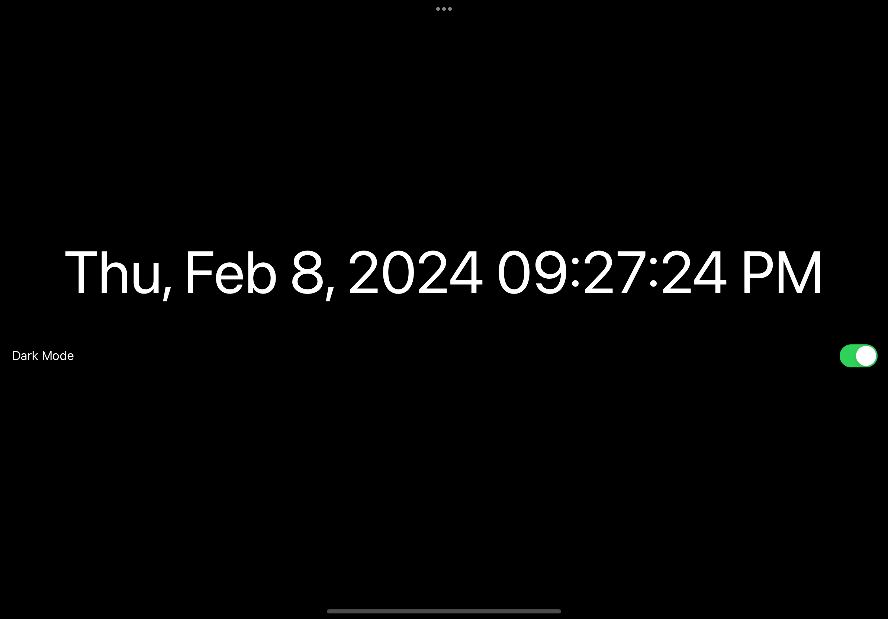
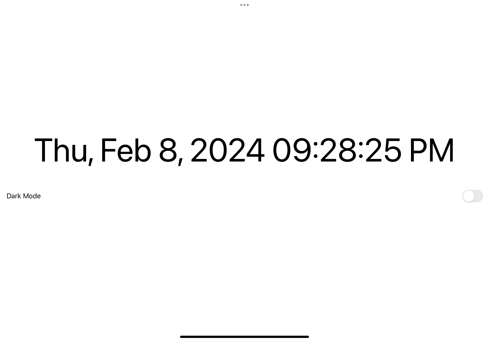

# Digital-Clock
A simple digital clock made with SwiftUI

Made it for my personal use - great for using it as a full-screen app on my iPad or on my MacBook display when connected to an external display.

## Screenshots

* Dark Mode of this App
  

* Light Mode of this App

## To-dos
* Add analog style (Not sure if I'll add this, since purpose of this app is for percise "seconds")
